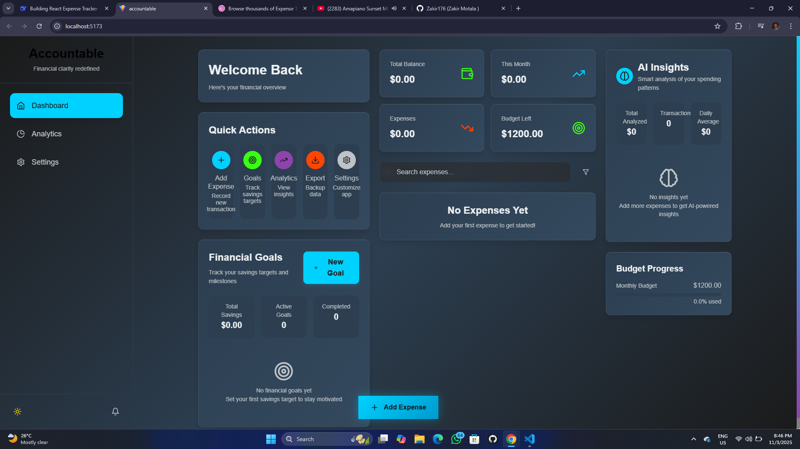
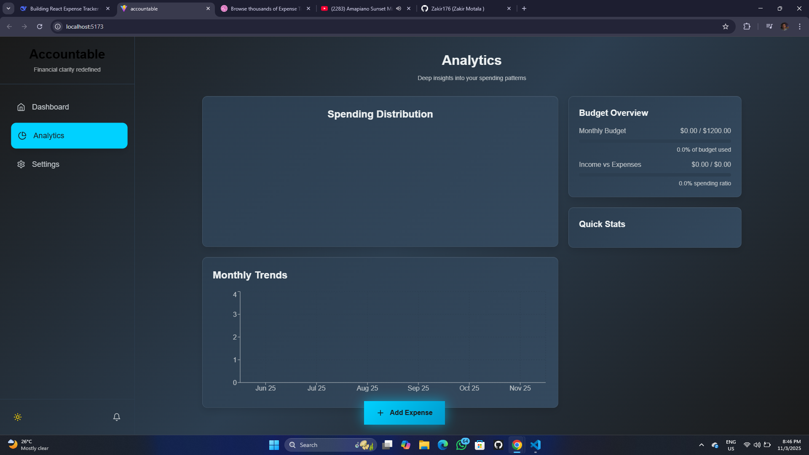
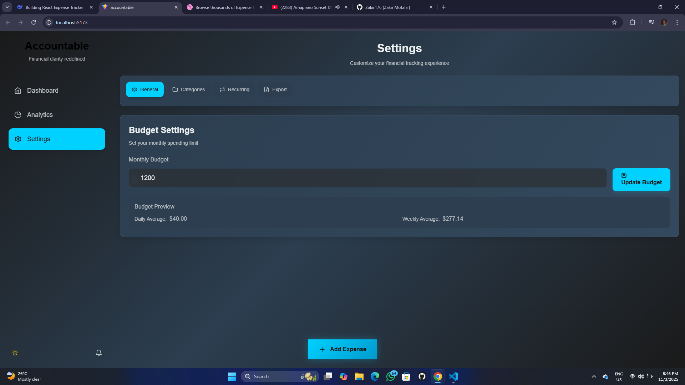
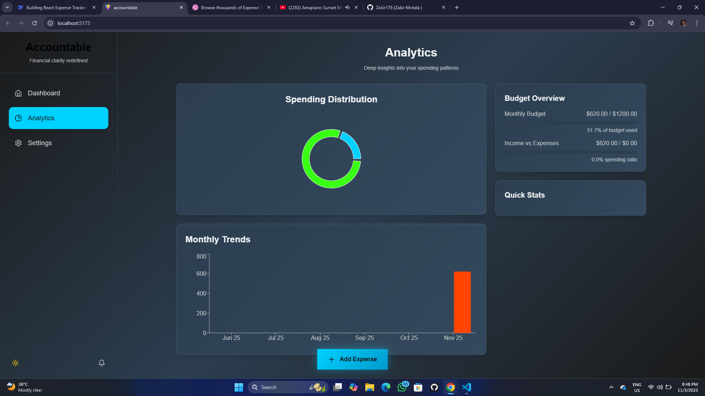

# 💎 Accountable


An expense tracker with beautiful animations and comprehensive financial insights.

[](https://react.dev/)
[](https://tailwindcss.com/)
[](https://vitejs.dev/)
[](https://www.typescriptlang.org/)
[](LICENSE)
[](http://makeapullrequest.com)

---

## ✨ Features

### 🎯 Core Functionality
- 💰 Expense Tracking — Add, edit, delete expenses with beautiful modals
- 📊 Financial Overview — Real-time balance, income, expenses, and budget tracking
- 🏷️ Custom Categories — Create personalized categories with custom colors
- 🔍 Smart Search — Filter by date, amount, category, and keywords
- 💾 Data Persistence — Automatic localStorage saving across sessions

### 🚀 Advanced Features
- 📈 Analytics Dashboard — Interactive charts and spending insights
- 🔄 Recurring Expenses — Automate daily/weekly/monthly transactions
- 🎯 Financial Goals — Set savings targets with progress tracking
- 🤖 AI Insights — Smart spending analysis and recommendations
- 🔔 Smart Notifications — Budget alerts and milestone celebrations
- 📤 Data Export — JSON, CSV, and PDF reports

### 🎨 Premium Design
- ✨ Glass Morphism — Frosted glass effects
- 🎭 Smooth Animations — 60fps transitions with Framer Motion
- 📱 Fully Responsive — Mobile, tablet, and desktop
- 🌙 Dark Theme — Futuristic dark interface with neon accents
- ⚡ Quick Actions — One-tap access to common features

---

## 🎥 Demo

### 📱 Mobile Experience
> Note: Mobile screenshots coming soon.

- Bottom navigation
- Floating action button
- Touch-optimized interface

### 💻 Desktop Experience





- Fixed sidebar navigation
- Multi-column dashboard
- Hover interactions

---

## 🛠 Tech Stack

**Frontend Framework**
- React 18 — UI library with hooks
- Vite — Fast build tool and dev server

**Styling & Design**
- Tailwind CSS — Utility-first CSS framework
- Framer Motion — Production-ready animations
- Lucide React — Beautiful icons

**Data & Charts**
- Recharts — Composable charting library
- Context API + useReducer — State management
- localStorage — Data persistence

**Code Quality**
- ESLint — Code linting
- Modern ES6+ JavaScript

---

## 🚀 Quick Start

### Prerequisites
- Node.js 18.0 or later
- npm or yarn

### Installation
1. Clone the repository
```bash
git clone https://github.com/yourusername/accountable.git
cd accountable

Copy

Insert

Install dependencies
npm install
# or
yarn

Copy

Insert

Start the development server
npm run dev
# or
yarn dev

Copy

Insert

Open your browser
http://localhost:5173

Copy

Insert

Building for Production
# Create production build
npm run build

# Preview production build
npm run preview

Copy

Insert

📁 Project Structure
accountable/
├── src/
│   ├── components/
│   │   ├── Dashboard.jsx
│   │   ├── ExpenseForm.jsx
│   │   ├── Analytics.jsx
│   │   ├── FinancialGoals.jsx
│   │   ├── AIInsights.jsx
│   │   └── ...
│   ├── context/
│   │   └── AppContext.jsx
│   ├── hooks/
│   │   ├── useTheme.js
│   │   └── useCurrency.js
│   ├── App.jsx
│   └── main.jsx
├── public/
└── package.json

Copy

Insert

💱 Currency Hook
A new hook centralizes currency formatting and conversion:

File: src/hooks/useCurrency.js
Exposes:
currency — default currency from AppContext
formatAmount(amount, targetCurrency = currency) — formats with Intl.NumberFormat
convertAmount(amount, fromCurrency, toCurrency) — converts using relative exchange rates
Notes:

Depends on useApp from src/context/AppContext.jsx
Safely defaults to 1 when a rate is missing to avoid runtime errors
🎨 Design System
Color Palette
Primary: #1A1A1A — Background, navigation
Accent: #00D1FF — Buttons, icons, highlights
Success: #39FF14 — Positive indicators, profit
Secondary: #2C3E50 — Text, secondary elements
Warning: #FF4500 — Errors, alerts
Text: #ECF0F1 — Main text, headings
Typography
Headings: Poppins (Semi-bold, Bold)
Body: Montserrat (Light, Regular, Medium)
Code: JetBrains Mono
Components
Border Radius: 10–12px
Shadows: Soft, depth-appropriate
Glass Effects: Backdrop blur with rgba backgrounds
Animations: Smooth 60fps transitions
🔧 Configuration
Environment Variables
Create a .env file in the project root:

VITE_APP_NAME=Accountable
VITE_APP_VERSION=1.0.0

Copy

Insert

Customizing Colors
Edit src/index.css:

:root {
  --color-primary: #1A1A1A;
  --color-accent: #00D1FF;
  --color-success: #39FF14;
}

Copy

Insert

📱 Responsive Design
Mobile (320px–767px) — Bottom nav, FAB
Tablet (768px–1023px) — Adaptive grids, optimized touch
Desktop (1024px+) — Fixed sidebar, multi-column dashboard
🚀 Deployment
Vercel
Fork repository
Connect GitHub to Vercel
Import repo and deploy
Netlify
Build project: npm run build
Drag dist folder to Netlify Drop
Other
GitHub Pages, Firebase Hosting, AWS S3 + CloudFront
🤝 Contributing
Fork the repo
Create a feature branch: git checkout -b feature/name
Commit changes: git commit -m "feat: add awesome thing"
Push branch and open a PR
Development Guidelines
Follow code style
Ensure responsiveness
Maintain smooth animations
Test on multiple browsers
Update docs as needed
🐛 Troubleshooting
Build fails

rm -rf node_modules
npm install

Copy

Insert

Styles not loading

Ensure Tailwind is configured
Verify dependencies
Data not persisting

Check localStorage
Look for console errors
📈 Roadmap
Coming Soon

Light theme
Multi-currency
Data import
Cloud sync
Advanced AI features
Future Plans

Mobile app (React Native)
Bank integration
Investment tracking
Family sharing
Plugin system
📄 License
MIT — see LICENSE

💙 Support
⭐ Star the repo
🐛 Report issues
💡 Suggest features
🔄 Share with others
![GitHub Stars](https://img.shields.io/github/stars/yourusername/accountable?style=for-the-badge